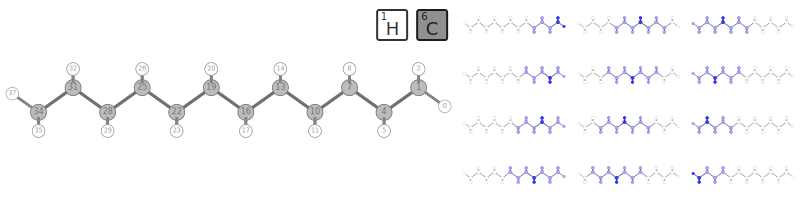

****************************************
Divide-conquer HF by Kobayashi and Nakai
****************************************

Case 1: Helium chains
=====================

The simplest case of closed-shell non-interacting systems assembled into a single model.
The Helium atoms are arranged into chains with 6A spacing.

Convergence
-----------

The study of how the error in density matrix elements decreases with iterations; :math:`N` is the number of Helium atoms
in the model.

.. plot:: plots/20-dchf-convergence-he_cached.py

Complexity
----------

The study of how the calculation time scales with the model increase.
The expected problem complexity in conventional HF is :math:`O(N^4)` while this implementation of DC-HF should scale
as :math:`O(N^2)` where :math:`N` is the number of atoms in the system.

.. plot:: plots/21-dchf-complexity-he_cached.py

Case 2: Hydrogen dimer chains
=============================

Study of 1D dimerized chains of hydrogen atoms where the minimal distance between nearest neighbours is 1.4A and the
maximal distance is 2.3A.

.. image:: plots/20-dimerized-hydrogen-chain.svg

Complexity
----------

The subject model is split into domains with 4 atoms in the core region and 2 atoms in the buffer region at both sides of
the domain (the 4(2) configuration).

The complexity is expected to be reduced from :math:`O(N^4)` of conventional HF to :math:`O(N^2)` for this implementation.

.. plot:: plots/21-dchf-complexity-hydrogen_cached.py

Domain size dependence
----------------------

Errors in HF energies (compared to conventional HF) as a function of the domain size, buffer size and run time.
The size of the chain considered is :math:`N=24`.

.. plot:: plots/23-dchf-errors-domain-hydrogen_cached.py

MP2 and CCSD energy corrections
-------------------------------

Errors in total energies :math:`E_\mathrm{HF}` (HF) and :math:`E_\mathrm{corr}` (MP2, CCSD; compared to conventional
approaches) as a function of the domain size, buffer size and the run time.
The chain size is :math:`N=24`.

.. plot:: plots/24-dcmp2-errors-domain-hydrogen_cached.py

The errors slightly depend on the theory parameter :math:`w_\mathrm{occ}` as shown on the following plot.

.. plot:: plots/26-dcmp2-errors-wocc-hydrogen_cached.py

Difficult cases
---------------

The DC-HF essentially assumes locality of molecular orbitals.
The more molecular orbitals extend, the larger error will be.
The dimerization in hydrogen chains prevents delocalization of orbitals.
Once the spacing between nearest hydrogens becomes equal, the orbitals become delocalized and the approximation fails.
The following two plots demonstrate absolute values of density matrixes (color) obtained from a conventional HF
calculation and DC-HF for both dimerized and uniform chains.

.. plot:: plots/25-dchf-errors-locality-demo_cached.py

The following two plots demonstrate how the total energy and the errors in DC-HF density matrix behave on the change of
dimerization parameter, the difference between the maximal and the minimal distance between nearest neighbours in the
chain.
The minimal distance is kept constant at 1.4A.

.. plot:: plots/25-dchf-errors-locality_cached.py

Case 3: Linear alkanes
======================

The benchmark model is :math:`\mathrm{C_{12} H_{26}}` split into ?? clusters by default.

The density matrix
------------------

.. plot:: plots/27-dchf-errors-locality-alkane_cached.py
